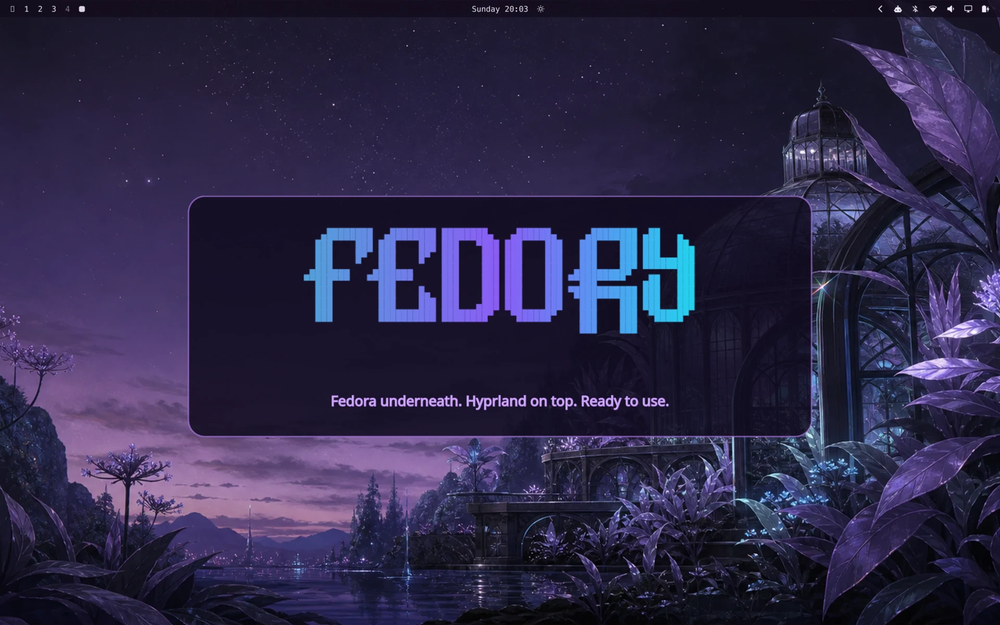
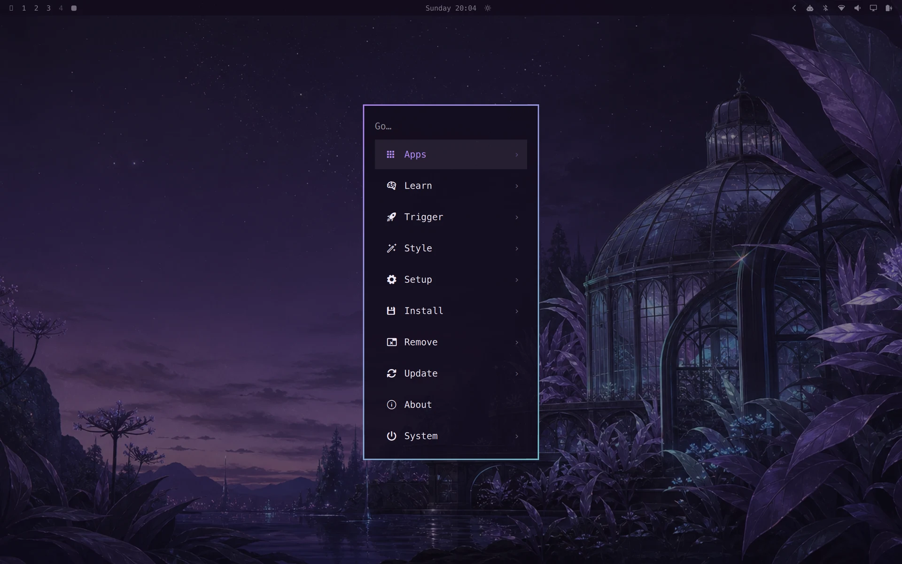

<p align="center">
  
</p>

<h1 align="center">Fedory</h1>

<p align="center">
  A developer-ready, gaming-capable Hyprland desktop for Fedora.
</p>

<p align="center">
  <strong>Fedora underneath. Hyprland on top. Ready to use.</strong>
</p>

<p align="center">
  <a href="#install">Install</a>
  ·
  <a href="#development-ready">Development</a>
  ·
  <a href="#gaming-on-fedora">Gaming</a>
  ·
  <a href="#complete-desktop">Features</a>
  ·
  <a href="#documentation">Documentation</a>
</p>

---

Fedory transforms a fresh Fedora Workstation installation into a complete, keyboard-driven Hyprland desktop.

It configures the window manager, desktop shell, development tools, gaming support, applications, login screen, boot visuals, notifications, screenshots, updates and system integrations for you.

You do not need to maintain a personal dotfiles repository or spend days assembling a working Hyprland environment.

Fedory is inspired by and ported from [Omarchy](https://github.com/basecamp/omarchy), but is adapted specifically for Fedora using DNF, COPR, Flatpak and Fedora-native system components.

## Install

Clone the repository so you can inspect the installer before running it:

```bash
git clone https://github.com/allisonhere/fedory.git
cd fedory
less bootstrap.sh
./bootstrap.sh
```

Or install directly from GitHub:

```bash
curl -fsSL https://raw.githubusercontent.com/allisonhere/fedory/master/bootstrap.sh | bash
```

Run the installer as a normal user, not as root. Fedory requests sudo access when system changes are required. It targets fresh or lightly customized Fedora Workstation installations; back up important files before installing it on a primary machine.

## Screenshots

<p align="center">
  
</p>

<p align="center"><em>Fedory Vesper — the default desktop experience.</em></p>

<p align="center">
  
</p>

<p align="center"><em>The Fedory command menu keeps applications, setup, styling and system actions close at hand.</em></p>

## Development ready

Fedory sets up a productive terminal and editor foundation with Git, Neovim, mise, modern command-line tools and optional Docker support. Language and framework environments can be installed on demand without manually assembling each toolchain.

```bash
fedory install dev-env node
fedory install dev-env python
fedory install dev-env rust
```

Installers are also available for Ruby on Rails, Go, PHP frameworks, Elixir and Phoenix, Java, Zig, .NET and other supported environments. Run `fedory install --help` to see the current list.

## Gaming on Fedora

Fedory provides focused installers for native, Windows and cloud gaming. Steam, Heroic and Battle.net setup includes the required 32-bit graphics libraries for the detected GPU, while Lutris adds Wine and Winetricks for other Windows games.

```bash
fedory install gaming steam
fedory install gaming heroic
fedory install gaming lutris
```

Battle.net, RetroArch, GeForce NOW and Xbox Cloud Gaming are also available through the Fedory menu and CLI.

## Complete desktop

Fedory installs and configures:

* Hyprland
* a desktop bar and application launcher
* notifications and system panels
* lock screen and idle behavior
* screenshots and screen recording
* clipboard and file utilities
* terminal and editor tooling
* Bluetooth, audio and network integration
* SDDM login theming
* Plymouth boot splash
* GRUB menu branding

The goal is not to give you a blank window manager.

The goal is to give you a finished desktop.

## One command for everything

Fedory includes a central command-line interface:

```bash
fedory
```

Common commands include:

```bash
fedory theme list
fedory theme set "Tokyo Night"
fedory update
fedory screenshot
fedory doctor
```

Run `fedory` without arguments to browse the available commands.

## Safe, repeatable updates

Fedory includes an update and migration system designed to keep existing installations working as the project changes.

```bash
fedory update
```

Updates can:

* fetch the latest Fedory version
* install newly required packages
* apply configuration migrations
* refresh desktop components
* preserve user-owned files where possible

Installer steps are designed to be repeatable. If setup is interrupted, running the installer again should reuse completed work.

## Installation details

### Requirements

Fedory currently targets:

* Fedora Workstation
* a normal non-root user with sudo access
* an internet connection
* a system capable of running Hyprland and Wayland

It makes substantial changes to your desktop, login manager, packages and configuration. Back up important files before installing it on a primary machine.

The installation normally takes around 15–30 minutes depending on your connection and hardware.

### Optional components

During installation, Fedory lets you include or exclude larger optional groups such as:

* office and media applications
* Docker
* printing and network discovery

The default selection installs the complete Fedory experience.

## After installation

When setup completes, reboot the machine:

```bash
systemctl reboot
```

Select the Fedory Hyprland session from the login screen if it is not selected automatically.

After logging in, run:

```bash
fedory
```

This opens the main Fedory command menu.

## Themes

Fedory includes coordinated color palettes and desktop backgrounds that can be changed live without reinstalling the desktop.

```bash
fedory theme list
fedory theme set "Tokyo Night"
```

## Tablet support

Fedory includes an optional tablet profile for convertible and touchscreen hardware.

The profile can provide:

* automatic display rotation
* touchscreen gestures
* touch-friendly interface sizing
* an on-screen keyboard
* internal display recovery
* tablet-specific systemd services

Enable it with:

```bash
fedory tablet enable
```

Disable it with:

```bash
fedory tablet disable
```

Tablet support depends heavily on the device, kernel and available sensors. See [`docs/tablet.md`](docs/tablet.md) for setup details and known limitations.

## Updating

Update Fedory with:

```bash
fedory update
```

Fedory tracks configuration changes through explicit migrations rather than blindly overwriting an existing home directory.

Before updating a critical workstation, review the latest commits or release notes.

## Troubleshooting

Start with:

```bash
fedory doctor
```

You can also collect local diagnostic information with:

```bash
fedory debug
```

Installation logs are normally written to:

```text
/var/log/fedory-install.log
```

Because installer steps are designed to be repeatable, the first recovery step after an interrupted installation is usually:

```bash
cd ~/.local/share/fedory
./bootstrap.sh
```

When reporting a problem, include:

* your Fedora version
* your graphics hardware
* whether the installation was fresh or customized
* the failing installer phase
* the relevant section of the install log

Please remove passwords, tokens, hostnames or other private information before sharing logs.

## Project status

Fedory is under active development.

It already provides a usable desktop, but it should still be considered early software. Some combinations of hardware, Fedora releases and existing system customization may not yet be fully tested.

The most reliable installation target is a fresh Fedora Workstation system.

Before installing Fedory on an important machine:

* keep a current backup
* know how to access a TTY
* keep Fedora installation media available
* review open issues for hardware-specific problems

## How Fedory differs from Omarchy

Fedory is not a Fedora ISO or an exact package-for-package copy of Omarchy.

Omarchy now uses an Arch-based custom installation model. Fedory instead installs on top of an existing Fedora Workstation system.

Fedory maps upstream components to Fedora-native alternatives through:

* DNF packages
* COPR repositories
* Flatpak
* source builds where necessary
* documented omissions where no suitable equivalent exists

This approach keeps Fedora responsible for the base operating system, hardware setup and installation process while Fedory owns the desktop experience layered on top.

See [`docs/scope.md`](docs/scope.md) for the full design rationale.

## Documentation

* [`docs/file-layout.md`](docs/file-layout.md) — repository and installed file layout
* [`docs/theming.md`](docs/theming.md) — theme palettes, templates and backgrounds
* [`docs/migrations.md`](docs/migrations.md) — configuration migration system
* [`docs/tablet.md`](docs/tablet.md) — tablet profile setup and limitations
* [`docs/upstream-sync.md`](docs/upstream-sync.md) — reviewing and porting Omarchy changes
* [`docs/ai-upstream-review.md`](docs/ai-upstream-review.md) — AI workflow for Omarchy review issues
* [`docs/scope.md`](docs/scope.md) — installation model and project boundaries
* [`AGENTS.md`](AGENTS.md) — contribution and porting conventions

## Contributing

Contributions are welcome, especially in these areas:

* Fedora hardware testing
* installer reliability
* AMD and Intel graphics support
* tablet and convertible devices
* documentation
* accessibility
* configuration migrations
* package mapping
* automated installation testing

Before submitting a pull request, read [`AGENTS.md`](AGENTS.md).

When porting an upstream Omarchy feature, preserve the original intent while adapting the implementation to Fedora rather than mechanically replacing Arch commands.

## Relationship to Omarchy

Fedory is an independent and unofficial Fedora port of [Omarchy](https://github.com/basecamp/omarchy), created by DHH and Basecamp.

Fedory is not affiliated with, maintained by or endorsed by Basecamp, 37signals or DHH.

Upstream-originated files and ideas are identified according to the project’s documented porting conventions.

## License

Fedory is released under the MIT License.

See [`LICENSE`](LICENSE).
